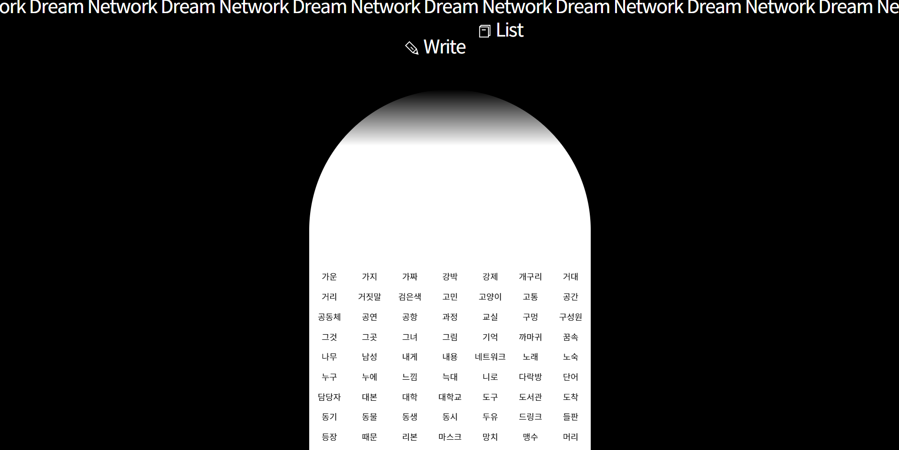

## 👋 소개

<hr />
이제 정말 10년이 되어가는 안산 중앙동에서의 다사다난했던 시기를 같이 걸었던 한 친구가 권하여 시작된 드림네트워크 프로젝트.

익명으로 꿈을 기록하는 목적을 지닌, 회원시스템조차 없는 간단한 게시판 개발이었기에 괜찮은 기회라 생각해서 직접적으로 사용해 본 적 없었던 Django를 사용하였고 키워드 자동 추출에는 Mecab을 썼다.

네개의 강의와 이인환각연쇄고리 제 1차, 그리고 드림네트워크를 지나 Koldsleep의 프로젝트는 아직 진행 중인 듯 하지만 나에게는 하나의 마무리가 된 경험들. 그리고 오류와 삽집들을 천천히 조금씩 기록해 볼 것이다.

## ✨ 사용 기술

- Django
- Python, Jquery
- Mecab (dev : eunjeon / prod : konlpy)
- mysql
- git
- ubuntu
- aws
- gunicorn
- nginx

​

## 🔥 Project Site

http://koldsleep.com/dreamnetwork

​

## 🎹 Team

- 기획 : 김미현
- 디자인 : 루드너드리드
- 개발 : 홍세영
- 후원 : 문화체육관광부, 한국문화예술교육진흥원, 서울특별시, 서울문화재단
- 주최 : koldsleep

```toc

```
