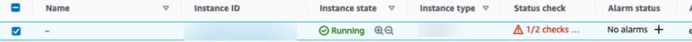
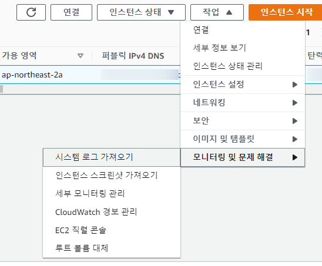
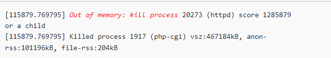
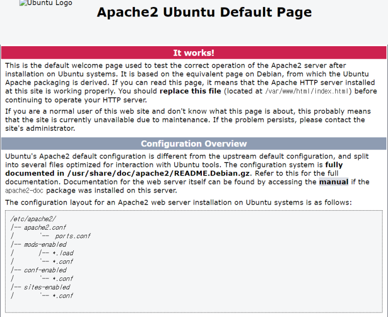
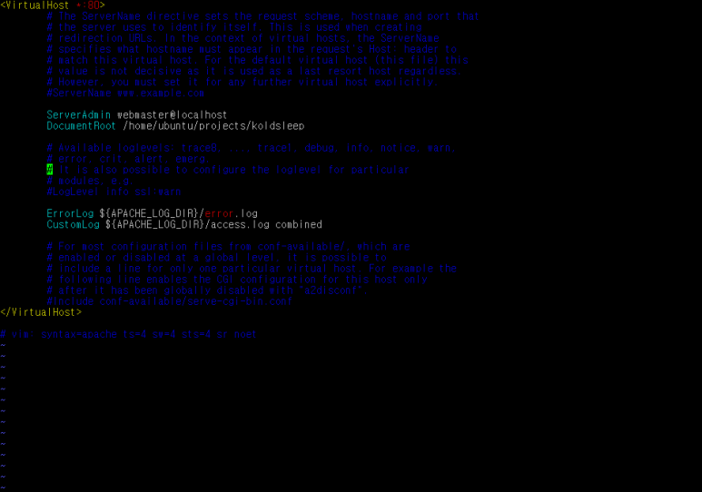
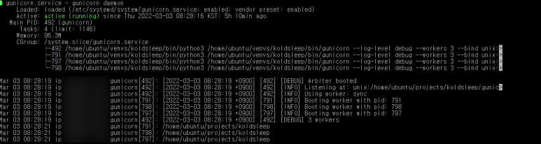
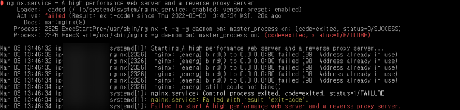
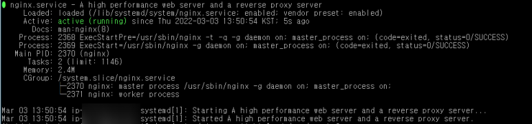

## 0. 문제의 발견

어느 날 갑자기 사이트가 먹통이라는 사업 담당자의 카톡이 왔다.

다행히 지금은 해결해서 드림 네트워크는 오늘도 여전히 꿈 기록을 보존하고 있다.

순서를 기다리다간 영영 기록되는 날이 오지 않을 것 같아서 당일 기록함. 한참 안될 때 캡쳐를 해 놨어야 했는데 그건 또 까먹었다.

​

## 1. 사이트 점검

콜드슬립 사이트를 우선 접속해 보았다. 사업 담당 미현이의 말대로 사이트는 서버가 연결되어 있지 않습니다 메시지만 덩그러니 띄우고 있었다.

​

## 2. AWS EC2 인스턴스 확인

다음은 인스턴스 상태를 보러 갔다. 이걸 다행이라고 해야 할지, 곧바로 원인이 눈에 띄었다.
<br>



<br>
상태검사에 딱 위처럼 빨간 불이 들어와 있었다.

상세한 원인을 파악하기 위해선 시스템 로그를 확인 해야 한다.

시스템 로그 확인은 아래 경로에서 할 수 있다.
<br>



<br>
위 경로를 찾아가면 뭐가 문제인지 에러 로그가 찍혀 있는 것을 발견할 수 있다.
이 경우엔 out of memory가 떡하지 찍혀 있었다.
<br>



<br>

프리티어 인스턴스라 메모리가 현저히 부족하긴 한데 어쩌다 오전에 튀었을꼬

메모리가 왜 부족한지 아는 것이 근본 해결이겠지만 급한 서버다운부터 우선 해결하기로 했다.

aws 공식 문서를 뒤지니 문서에선 인스턴스를 아예 새로 만들거나 재부팅 하는 것을 권장하고 있었다. 새로 만드는 것은 아무래도 번거로워 재부팅을 했더니 도메인에 인스턴스가 연결이 다시 되긴 되었다. 되긴... 되었는데
<br>



<br>
위와 같은 아파치2 우분투의 디폴트 페이지가 나타났다.

혹시 서버 내의 프로젝트 폴더가 날아갔나 혹시 그럼 가상머신도 날아갔나 혹시 그럼 가상머신에 설치한 라이브러리도 싹 다 날아갔나... 그럼 (개발 시기동안 제일 삽질한) 서버 설정도 날아갔나... 무척이나 설렜으나... 다행히 부랴부랴 putty를 열어보니 폴더들과 내가 세팅해 둔 가상환경들은 모두 그대로였다.

찾아보니 이 디폴트 페이지가 설정된 파일을 열어서 설정만 바꿔 웹서버를 재구동 하면 된다고 한다.
​

## 3. 디폴트 페이지 설정 및 서버 재구동

디폴트 페이지 설정은 /etc/apache2/sites-available/ 에서 할 수 있다. 파일 명은 000-default.conf 다. 이 파일을 열어 DocumentRoot를 재설정해준다. 이 파일은 기본적으로 readonly 이므로 관리자 권한으로 열어야 한다.
<br>

```console
sudo vi /etc/apache2/sites-available/000-default.conf
```

<br>



<br>

원래는 저 DocumentRoot가 \var\www\html\ 로 설정 되어 있다. 이것을 내 프로젝트가 있는 디렉토리로 경로를 바꿔주고 저장한다.

그리고 새로 설정한 루트문서 권한을 허용하기 위해 apache2.conf 파일의 설정을 바꿔야 하므로

<br>

```console
sudo vi /etc/apache2/apache2.conf
```

<br>


<br>

Require 부분이 문서를 연 직후에는 all denied로 되어 있는데 all granted로 변경해준다.

​

여기까지 하면 디폴트 페이지를 변경하는 작업은 다했다!

맘 놓고 gunicorn을 restart 했다.

그런데도? koldsleep.com 도메인에 접속하면 여전히 디폴트 페이지가 떠올라 있었다.

gunicorn.service 의 상태를 확인해봤다.
<br>



<br>

멀쩡한데...? 뭐가 문제지...?

뭐가 문제냐면 nginx를 restart 하지 않은 것이다...

nginx 상태를 보니 이랬다.
<br>



<br>

80포트를 이미 쓰고 있다고 함.

침착하게 sudo systemctl restart nginx를 nginx.service 가 있는 경로에서 입력하고

다시 status를 확인했다.
<br>



<br>

ㅎ........

사이트 재접속 해봄

http://koldsleep.com

허무한 해결,,,

메모리가 터진건 짐작이지만

사용자가 쓴 글에서 키워드를 추출해 대문에 박는 과정이 조금 복잡한 것 같기는 하다.

​

1. 사용자가 쓴 글을 가져옴

2. mecab을 통해 명사를 뽑음

3. 명사 중에 중복 두번 이상 쓰인 키워드만 추출함

4. 한글자짜리 명사를 전부 제외시킴

5. 데이터베이스에 이미 저장된 키워드를 전부 가져옴

6. 신규 키워드를 하나하나 대조해서 기존 데이터베이스에 존재하지 않는 것만 남겨 둠

7. 걸러진 나머지를 전부 저장함

​

...

조금...

음 글로 보면 복잡해 보이는데 코드로 보면 별 거 없긴 함.

파이썬 코드로 보면 글쓰기 로직 중간에 키워드 추출을 하기 위해 이런게 박혀 있다.

```python
####### 키워드 저장 시작 ########
new_text = request.POST['content']
# 명사 추출
mecab_nouns = mecab.nouns(new_text)
# 두 번 이상 쓰여진 키워드만
result = Counter(mecab_nouns)
new_key = []
for key, value in result.items() :
    if value > 1 :
        new_key.append(key)
# 한글자 제외
new_keywords = [word for word in new_key if len(word) > 1 ]
# 데이터베이스 전체 키워드
all_key = Keyword.objects.all().values_list('word', flat=True)
all_key = list(all_key)
# 데이터베이스에 이미 저장되어 있으면 제외
for keyword in new_keywords :
     if keyword not in all_key :
        Keyword(word=keyword).save()
board.save()
```

<br>

이제 슬슬 기존 키워드가 많아지면서 이 8기가로 버거워진 순간이 생긴거 아닌가 싶다.

현재 그냥 서버가 띄워져 있는 것만으로 이미 8기가 중 6기가를 사용하고 있으니... 글 하나 올리거나 수정하거나 삭제할 때 나머지 2기가에서 해결을 봐야 한다.

음. 솔직히 가벼운 프로젝트라서 큰 문제가 없을거라 생각했는데 여러 사용자가 동시에 mecab과 db를 돌리면 묵직하지 않을 수가 없긴 하다.

해결하려면 코드를 훨씬 더 효율적으로 바꾸거나 메모리를 늘려야하는데 메모리를 늘리려면 프리티어를 벗어나 유료 인스턴스로 전환해야 해서 무리고...

고민 좀 해봐야겠음.
<br>

### 관련 프로젝트 바로가기! 👉 [드림네트워크 프로젝트](https://maiorem.github.io/dreamNetwork_01/)

```toc

```
