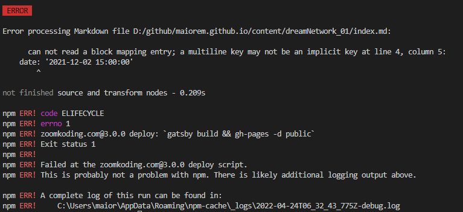

## 👋 소개

<hr />
npm run deploy 를 실행하는데 어제까지만 해도 잘 되던 배포가 오늘 갑자기 에러를 뱉는다.



찾아보니 npm을 사용하는 vue react angular 등의 프레임워크를 빌드할 때 공통적으로 발생 한다고 한다.

우선 검색해서 가장 먼저 나오는 방식을 Visual Studio Code 의 PowerShell 에서 실행하려 시도했다.

$ npm cache clean --force  
$ rm -rf node_modules package-lock.json  
$ npm install

그런데 rf를 visual studio code가 읽지 못해 또 "매개 변수 이름 'rf'과(와) 일치하는 매개 변수를 찾을 수 없습니다." 오류메시지를 뱉는다.

powershell에서는 안되고 bash에서 문제를 해결해야 한다고 한다.
vsc에서 bash를 여는 방법은

1. Ctrl+Shift+P 를 누르고 오픈된 상단의 팔레트에서
2. Select Default Profile 을 선택
3. 터미널 옆의 + 를 누르면 bash 가 생긴다.

이제 bash에서 위 명령어를 차례대로 하면  
새롭게 npm Error:EPERM 에러를 일으킨다!

이건 파일이 읽기전용이거나 잠겨서 생긴 에러로

$ npm install --force

를 통해 강제로 설치를 해 주면 해결 된다.
이제 캐시를 지우고 npm 을 새롭게 설치하였으니 deploy를 다시 시도해 보자....

```toc

```
